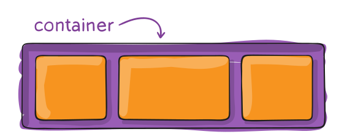
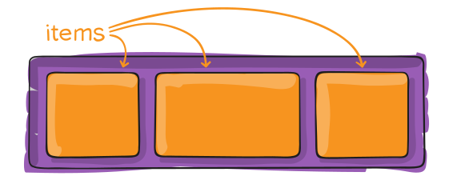
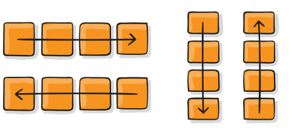
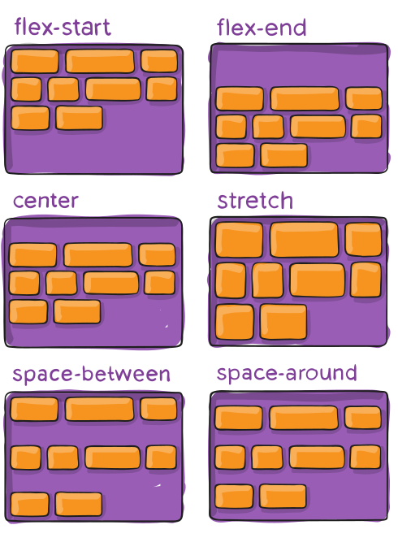

> I'm Zaw Linn Tun a Frontend Web Developer on [Zaw Linn Tun](https://www.facebook.com/zawlinn.profile). :heart:

<br>

## Languages &mdash;

<!--  -->

What I use packages are &mdash;

[](https://skillicons.dev)

<br>

# CSS Layout System &mdash;?

layout ဆိုတာ text တွေ images တွေနဲ့ အခြားသော content တွေကို webpage ပေါ်မှာ ဘယ်လိုချထားမလဲဆိုတာကို ပြောတာပဲဖြစ်ပါတယ်။

layout က webpage ကို visual structure တစ်ခုပေးပါတယ်။ အဲဒီ visual structure ထဲမှာ content တွေကို ထည့်သွင်းရပါတယ်။

layout ဆိုတာ နဂိုတည်ရှိနေသော normal flow(one to another) အဖြစ်ကနေ visual structure တည်ဆောက်ပီး content တွေကို လှပရှင်းလင်းအောင် တည်ဆောက်တာပဲ ဖြစ်ပါတယ်။

layouts 3 မျိုးရှိတယ် &mdash;

1. Float Layout(old method)
2. Flex Layout(one dimensional layout) - simple layout တွေမျာသုံး
3. CSS Grid(two dimensional layout) - complex layout တွေမှာသုံး

# Float Layout &mdash;

float က nomal flow ကနေ ထွက်လာတာ ဒါကြောင့် အောက်မာရှိတဲ့ content တွေအပေါ်ကို ရောက်နေတာ ဒါပေမဲ့ text တွေကတော့ သူကို wrap လုပ်ပေးထားတယ် နေရာကတော့ သူ့နေရာနေစပြီးတော့ အပြည့်ယူတယ်။

float ကနေ ထွက်ချင်ရင် clear: left/right/both ကို အသုံပြုနိုင်တယ်။

# Flex Box &mdash;

flex ကို one dimensional layout တွေအတွက် အသုံးပြုနိုင်ပါတယ်။ horizontal or vertical အနေနဲ့ပါ အသုံးပြုနိုင်တယ်။ အသုံးများတာကတော့ easy to make center and creating navbar တွေအတွက်ဖြစ်ပါတယ်။ flex ကို အသုံးပြုရန် parent ကို `display:flex;` ပေးရမယ်

```css
selector {
  display: flex;
}
```


```css
.row {
  flex-direction: column / row / column-reverse / row-reverse;
}
```

column က default ဖြစ်ပီးတော့ `main-axis` လို့ခေါ်တယ်။ row ကိုတော့ `cross-axis` လိုခေါ်ဆိုပါတယ်။

### Flex Container &mdash;



### Flex Items &mdash;



### Flex Direction &mdash;



### Align items &mdash;

ပုံမှန်အရ `align-items` ဟာ vertical အတွက်ဖြစ်ပေမဲ့ flex-direction ပေါ်မူတည်ပီး အလုပ်လုပ်ပုံကွာခြားသွားနိုင်ပါတယ်။

```css
.row {
  align-items:
    stretch(defult), flex-start/start/self-start, flex-end/end/self-end, center,
    baseline;
}
```


baseline က text ဆိုဒ် မတူတဲ့အခါ အသေးဆုံး text ရဲ့ အောက်ခြေကို ယူပီး ညှိတာဖြစ်ပါတယ်။

> align items ရဲ့ default က stretch ဖိတာကြောင့် child တွေရဲ့ height က သွားတူနေတာ မတူစေချင်ရင် align-items:flex-start ကို သုံးရမယ်။ သို့မဟုတ် align-self: self-start ကိုသုံးလည်းရတယ်။

### Justify Content &mdash;

```css
justify-content:
  flex-start(default), flex-end, space-between, space-aroung, space-evenly,
  center;
```


### Flex Wrap &mdash;

ပုံမှန်အားဖြင့် (Default အနေနဲ့) Flex Item များအားလုံးကို တစ်ကြောင်းတည်း (one line) အတွင်း ဝင်အောင် စီစဉ်ရန် ကြိုးစားပါသည်။

ဒီ Property ကို အသုံးပြုခြင်းဖြင့် ထိုအပြုအမူကို ပြောင်းလဲနိုင်ပြီး၊ နေရာမလုံလောက်သည့်အခါ Flex Item များကို နောက်တစ်ကြောင်းသို့ အလိုအလျောက် ဆင်းစီ (Wrap) နိုင်အောင် ခွင့်ပြုပေးနိုင်သည်။

```css
.container {
  flex-wrap: nowrap | wrap | wrap-reverse;
}

/*

  nowrap (default): all flex items will be on one line

  wrap: flex items will wrap onto multiple lines, from top to bottom.

  wrap-reverse: flex items will wrap onto multiple lines from bottom to top.
*/
```

### Align Content &mdash;

ဤ Property သည် Cross Axis တွင် နေရာလွတ် (Extra Space) ရှိနေသောအခါ Flex Container အတွင်းရှိ Line များကို Management လုပ်ပေးနိုင်သည်။

align-content က Cross Axis ပေါ်ရှိ Flex Line များကို စိတ်ကြိုက် ပြင်ဆင်ပေးနိုင်သည်။

> မှတ်ချက် - ဤ property သည် `flex-wrap` ကို `wrap` သို့မဟုတ် `wrap-reverse` ဟုသတ်မှတ်ထားသည့် multi-line flexible containers များတွင်သာ အကျိုးသက်ရောက်မှုရှိသည်။ single-line flexible container (ဆိုလိုသည်မှာ `flex-wrap` ကို ၎င်း၏ default value ၊ no-wrap ဟုသတ်မှတ်ထားသည့်) သည် `align-content` အလုပ်လုပ်မည်မဟုတ်ပါ။

```css
.container {
  align-content: flex-start | flex-end | center | space-between | space-around |
    space-evenly | stretch | start | end | baseline | first baseline | last
    baseline +... safe | unsafe;
}
```



### Flex Items &mdash;

`flex-grow` ဆိုတာ ပိုနေတဲ့ နေရာကို အညီအမျှ ယူလိုက်တာပဲ ဖြစ်ပါတယ်။ အကယ်၍ el တစ်ခုကို `flex-grow: 2;` လို့သတ်မှတ်ပြီး ကျန်တာတွေကို `flex-grow: 1;` လို့သတ်မှတ်ထားရင် `flex-grow: 2;` က ပိုနေတဲ့ နေရာရဲ့ နှစ်ဆကိုသာယူတာ ဖြစ်ပါတယ်။ အခြား el ရဲ့ width နှစ်ဆရှိရမှာမဟုတ်ပါဘူး။ ဥပမာ &mdash;

`flex-container` width က 1300px ရှိတယ်ဆိုပါစို့ el က 6 ခု။ တစ်ခု 100px နဲ့ 6 ခု ဒါဆိုရင် 600px နေရာလွတ်က 700px ရှိမယ်။ အားလုံးကို`flex-grow: 1` သတ်မှတ်ရင် el တစ်ခုခြင်းဆီက total width (100+116.66) က 216.66px ဖြစ်လိမ့်မယ်။ အကယ်၍ el တစ်ခုကိုသာ `flex-grow: 2;` ပေးလိုက်ရင်တော့ အဲဒီ el က နှစ်ဆဖြစ်တဲ့ 200px ယူလိုက်မှာဖြစ်တဲ့အတွက် သူ့ရဲ့ total width က 300px (100+200) ဖြစ်ပီးတော့ ကျန်တဲ့ el တွေက 200px(100+100) ဖြစ်နေတာ တွေ့ရမှာဖြစ်ပါတယ်။


### Flex Basis &mdash;

ဒီ Property က ကျန်ရှိတဲ့ space တွေကို မျှဝေမပေးခင် element ရဲ့ မူလအရွယ်အစား (default size) ကို သတ်မှတ်ပေးတာ ဖြစ်ပါတယ်။

ဒီနေရာမှာ length value တွေ ဥပမာ 20%, 5rem စတာတွေကို သုံးနိုင်သလို keyword တွေကိုလည်းအသုံးပြုနိုင်ပါတယ်။

auto keyword ဆိုတာက element ရဲ့ width ဒါမှမဟုတ် height property ကို ကြည့်ပြီး အရွယ်အစား သတ်မှတ်ပါလို့ ဆိုလိုတာပါ။


### Aligan Self &mdash;

၎င်း Property သည် Flex Item တစ်ခုချင်းစီအတွက် မူလသတ်မှတ်ထားသော Alignment (သို့မဟုတ် align-items ဖြင့် သတ်မှတ်ထားသော Alignment) ကို သီးသန့် Override (အစားထိုးသတ်မှတ်) လုပ်နိုင်စေသည်။

```css
.items {
  flex-grow: 0; /* 0 is default */
  flex-shrink: 1; /* 1 is default */
  flex-basis: 100px; /* px, percent, vw and etc. */

  /* ဒါမဲ့ flex ဆိုတဲ့ shorthand property ကိုသာ အသုံးပြုသင့်ပါတယ် */

  /* flex: flex-grow flex-shrink flex-basis; */

  flex: 1; /* ဒါက flex-grow: 1; ကို သတ်မှတ်လိုက်ခြင်းပဲ ဖြစ်ပါတယ်။ */

  .item {
    align-self: auto | flex-start | flex-end | center | baseline | stretch;
  }
}
```

# CSS Grid &mdash;

CSS Grid Layout (အတိုကောက် Grid သို့မဟုတ် CSS Grid) သည် Two-Dimensional (၂ ဖက်မြင်) Grid အခြေပြု Layout စနစ်တစ်ခုဖြစ်ပြီး၊ ယခင် Web Layout စနစ်များအားလုံးနှင့် နှိုင်းယှဉ်လျှင် User Interface (UI) များကို ဒီဇိုင်းဆွဲသည့် နည်းလမ်းကို လုံးဝပြောင်းလဲပေးထားသော နည်းပညာတစ်ခုဖြစ်သည်။

```css
.container {
  display: grid;
  grid-auto-flow: dense | column | row | row dense| column dense;
  grid-template-columns: px | rem | fr | % | repeat(2, minmax(min, max));
  gird-template-rows: px | rem | fr | %;
  grid-auto-columns: px | rem | fr | %;
  grid-auto-rows: px | rem | fr | %;
  gap: row column;

  grid-template-areas:
    "head head head"
    "nav nav nav";

  place-content: align-content justify-content;
  place-items: align-items justify-items;

  /*
    place-content: start, end, center, space-between, space-around, space-evenly;

    place-items: start, end, center, stretch, space-between, space-around, space-evenly, normal;
  */

  grid-column: grid-column-start grid-column-end;
  grid-row: grid-row-start grid-row-end;

  /*
    1/ 4 - start / end 
    span 2 / 3 / 4; 
  */

  grid-area: <row-start> / <column-start> / <row-end> / <column-end>;
}

.header {
  grid-area: head;
}

.nav {
  grid-area: nav;
}
```

<!-- TODO: Add last video link -->

📫 Reach me out!

[](https://m.me/zawlinn.profile)
[](mailto:zawlinn.profile@gmail.com)

<details>
    <summary>
        My Portfolio
    </summary>
    <br/>

- :earth_asia: I’m currently working at @Mae Sot Market as a sale staff
- :computer: Most used line of code git commit -m "Initial Commit"
- :brain: I’m looking for help with Outstanding Video ideas.
- :mailbox_with_mail: How to reach me: zawlinn.profile@gmail.com.
- :heart: In a relationship with React
</details>
